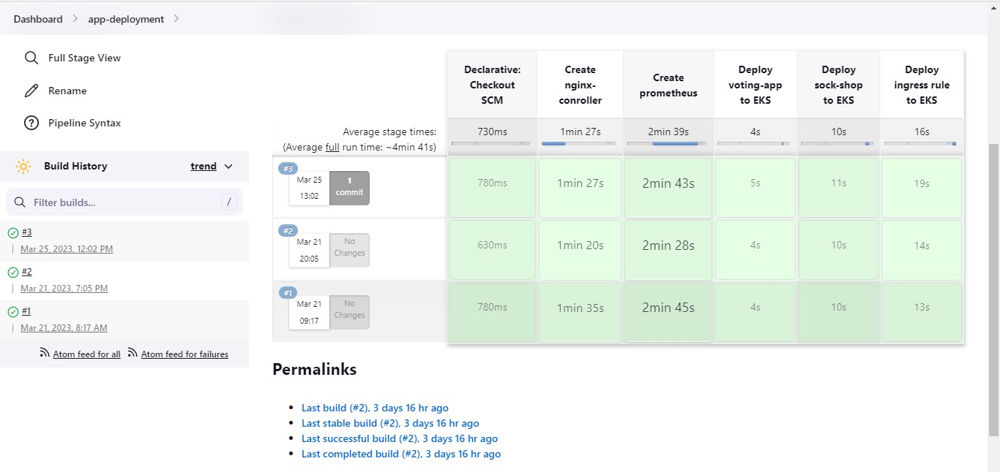
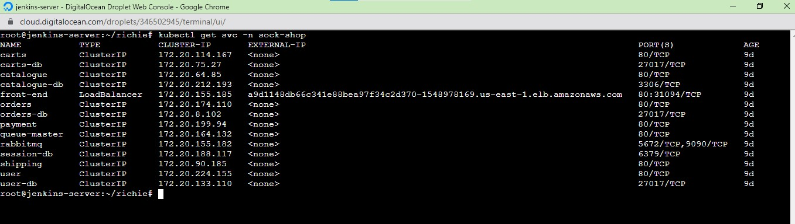
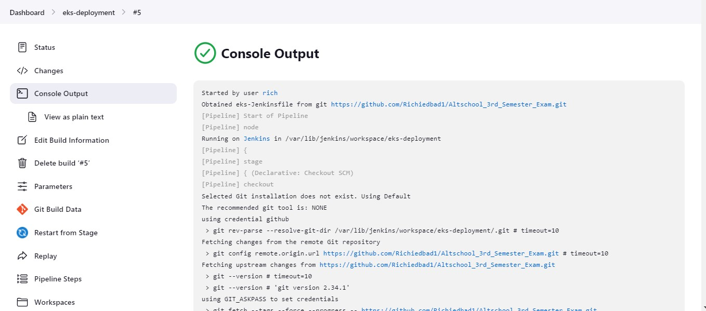

# Altschool Third Semester Examination Screenshots

1. Custom App

1. Microservice App

1. Deployment Snapshots

1. Kubernetes Cluster Pipeline

1. Custom App Pipeline

1. Running Services on Kubernetes Cluster

1. Custom App loadbalancer

1. Microservice Loadbalancer

1. Prometheus Snapshot

1. AWS EKS Cluster

1. Pods

1. Servers deployed in AWS by Terraform

1. Route 53

1. Jenkins Server

1. Terraform Apply Snapshots

1. Billing Snapshot

