# Altschool Third Semester Examination Screenshots

## Custom App
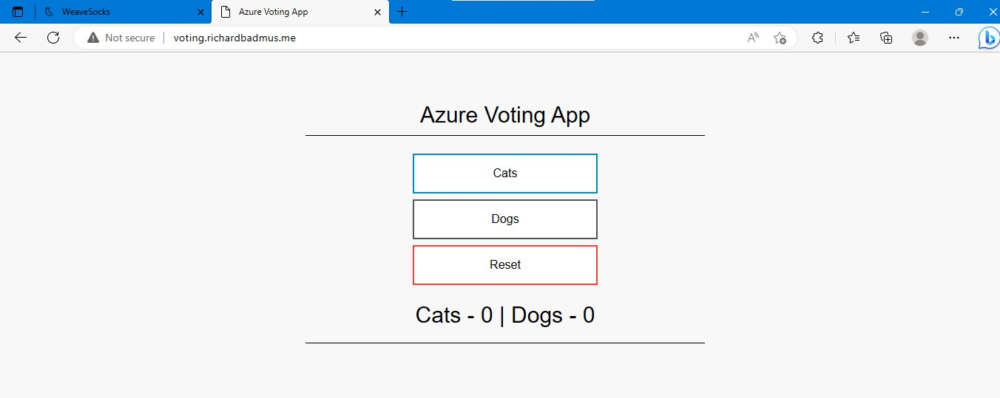

## Microservice App
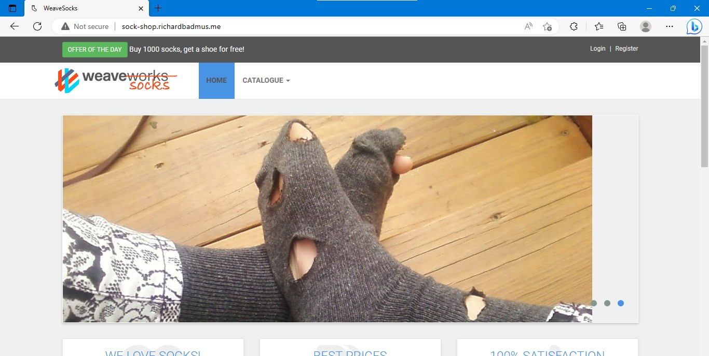

## Deployment Snapshots
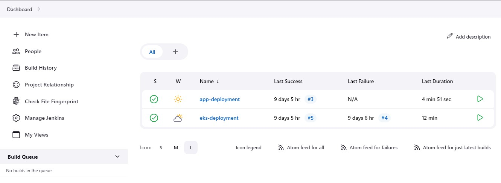

## Kubernetes Cluster Pipeline
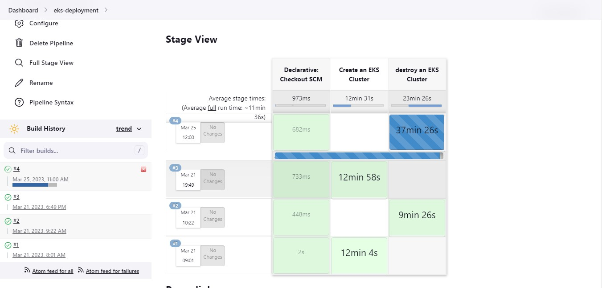
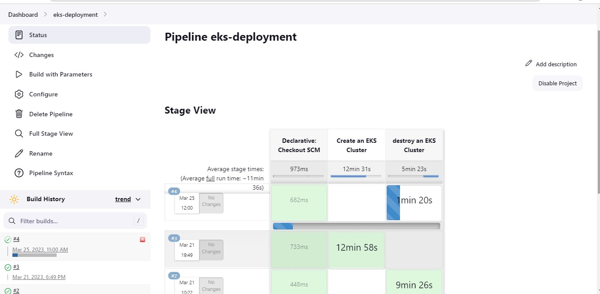

## Custom App Pipeline
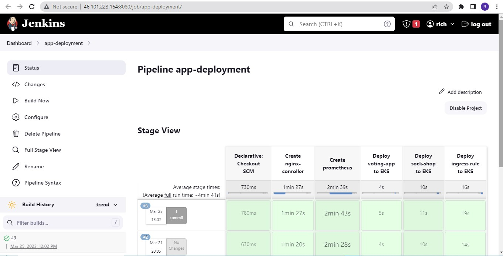

## Prometheus Snapshot

## AWS EKS Cluster
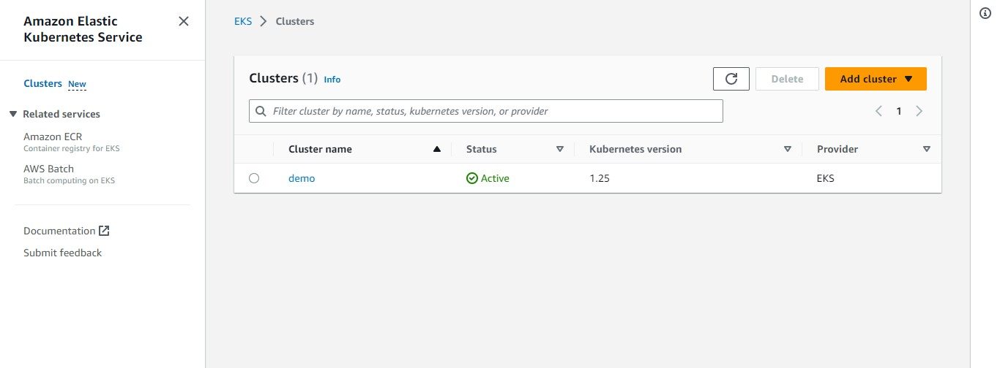
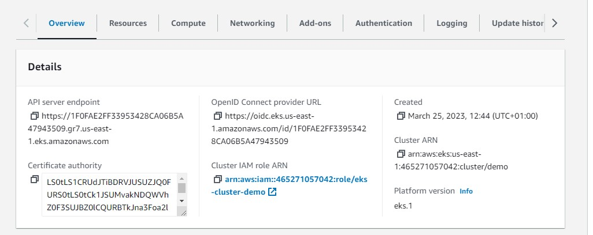

## Pods
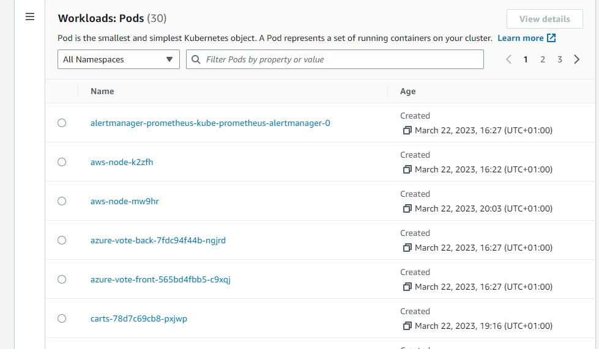

## Servers deployed in AWS by Terraform
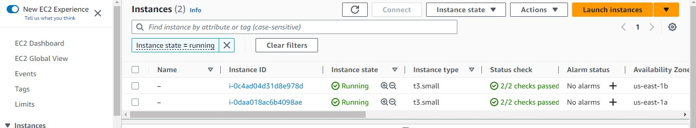

## Route 53
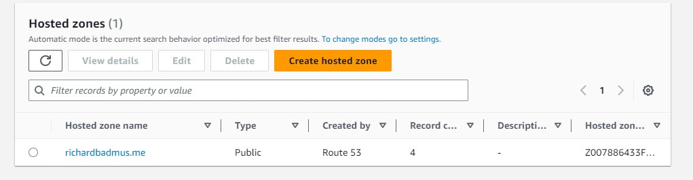
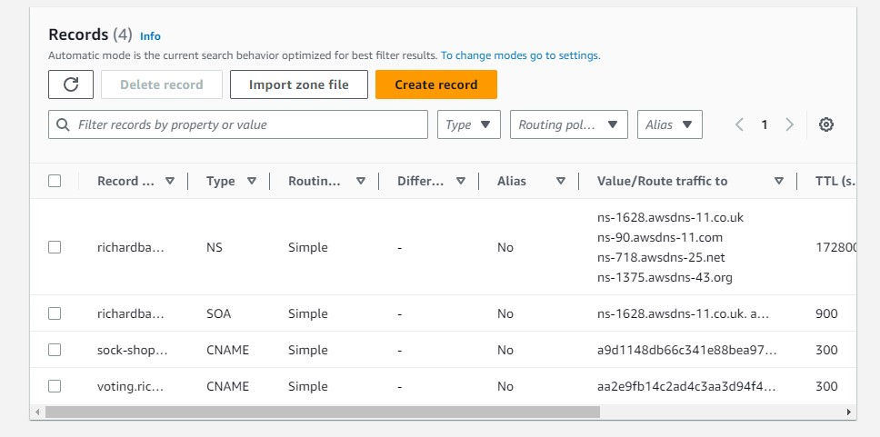

## Jenkins Server
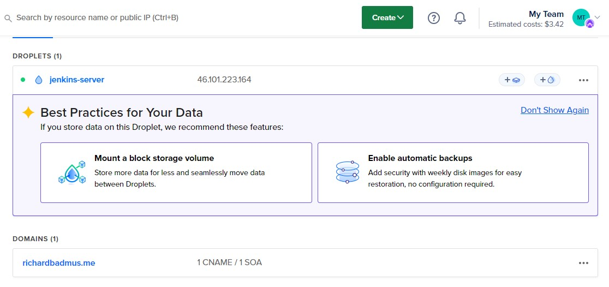

## Terraform Apply Snapshots

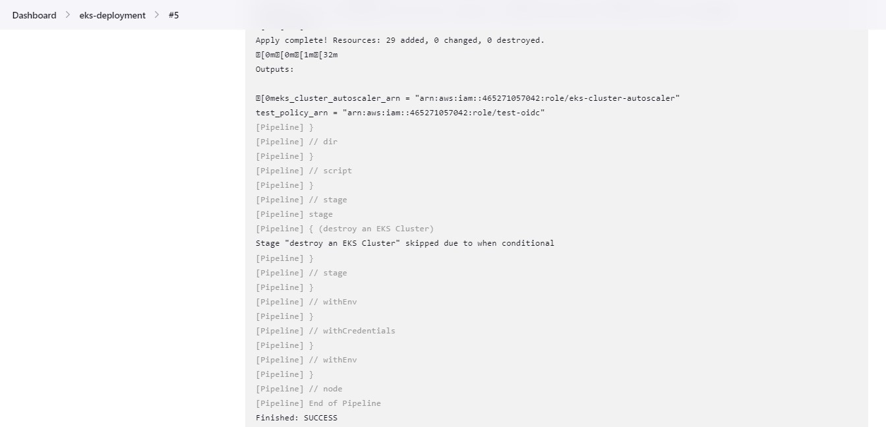
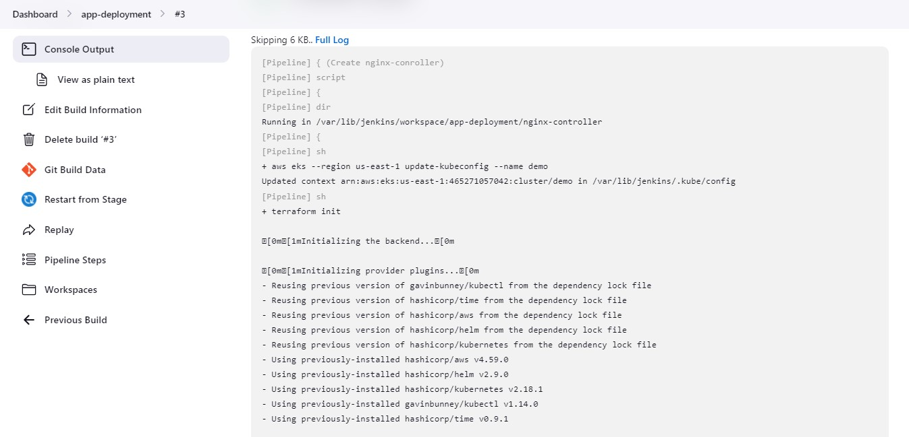
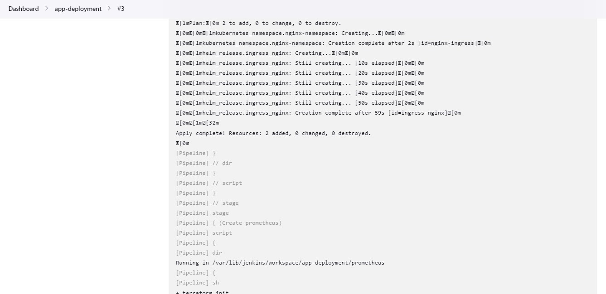
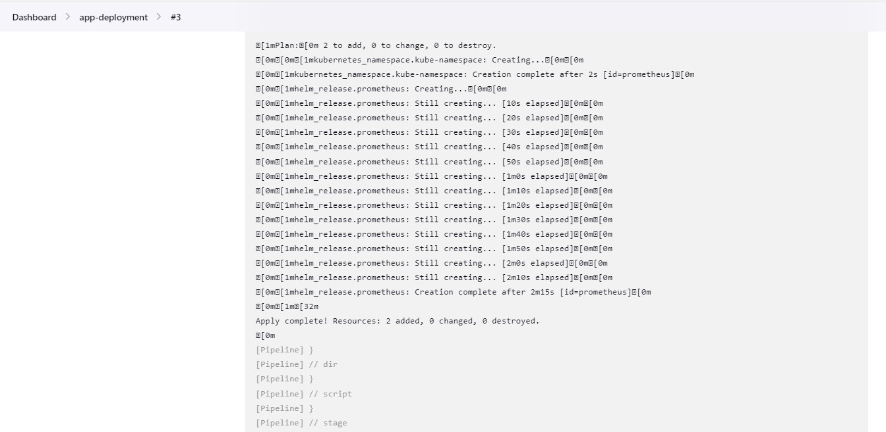
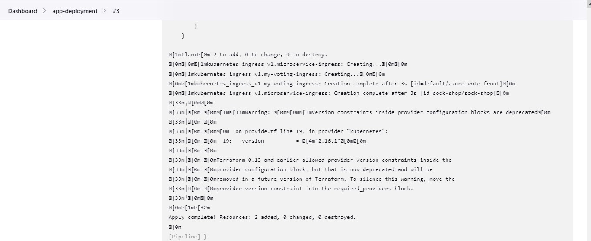

## Billing Snapshot
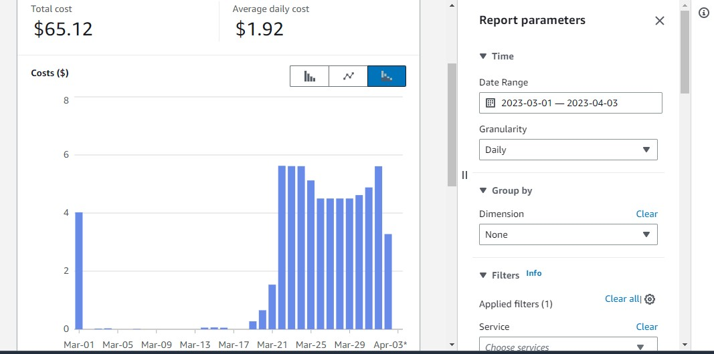
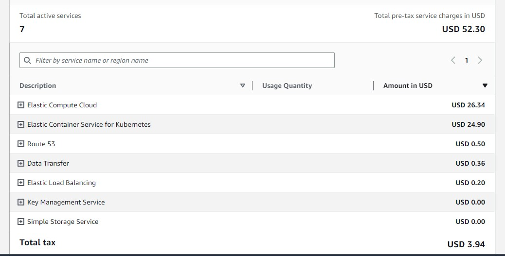

